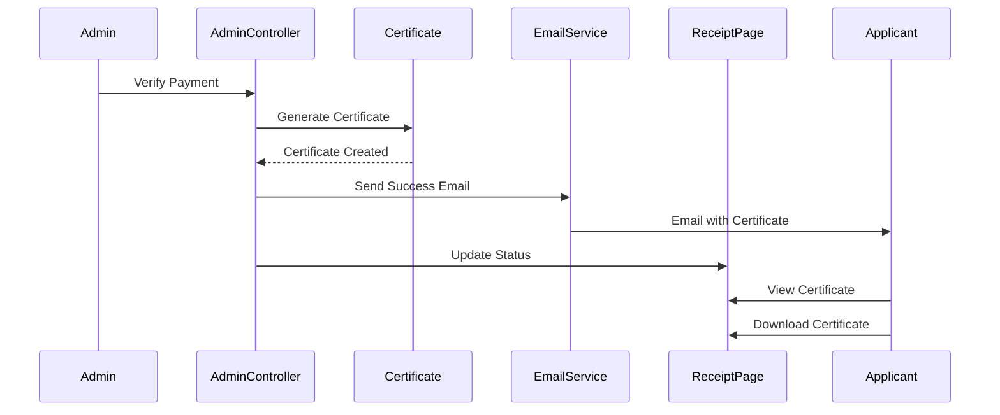

# Enhanced Approval Notification System Design

## Overview

This design document outlines the technical implementation for enhancing the payment verification workflow to include comprehensive email notifications and receipt page certificate display functionality. The system will provide a seamless experience from admin payment verification to applicant certificate access.

## Architecture

### High-Level Flow
```
Admin Verifies Payment → Certificate Generation → Email Notification → Receipt Page Update
```

### Component Interaction


## Components and Interfaces

### 1. Enhanced AdminController
**File:** `app/Http/Controllers/AdminController.php`

**Enhancements:**
- Modify `verifyPayment()` method to send enhanced success email
- Ensure certificate generation completes before email sending
- Add proper error handling and logging

**Key Methods:**
```php
public function verifyPayment(Request $request, $paymentId)
public function generateCertificate($payment) // Enhanced
```

### 2. Enhanced Email Templates
**Files:** 
- `app/Mail/CertificateIssued.php` (enhance existing)
- `resources/views/emails/certificate-issued.blade.php` (enhance existing)

**Enhancements:**
- Update subject line to emphasize successful verification
- Improve email content with congratulatory messaging
- Add clear instructions for receipt page access
- Include certificate details prominently

### 3. Enhanced Receipt Page Component
**File:** `resources/js/Components/Receipt/index.jsx`

**Enhancements:**
- Display verified badge with green checkmark
- Show certificate information in highlighted green box
- Add prominent "Download Certificate" button
- Include "View Receipt" secondary button
- Match reference design exactly

### 4. Certificate Download Controller
**File:** `app/Http/Controllers/PaymentController.php`

**Enhancements:**
- Ensure `downloadCertificate()` method handles proper logging
- Update certificate status to "collected" on first download
- Provide proper filename formatting

## Data Models

### Payment Model Enhancements
**File:** `app/Models/Payment.php`

**Relationships:**
```php
public function certificate(): HasOne
{
    return $this->hasOne(Certificate::class, 'payment_id');
}
```

### Certificate Model Enhancements
**File:** `app/Models/Certificate.php`

**Status Values:**
- `generated` - Certificate created
- `sent` - Email sent with certificate
- `collected` - Certificate downloaded by applicant

**Key Methods:**
```php
public static function generateCertificateNumber(): string
```

### Request Model Integration
**File:** `app/Models/Request.php`

**Enhanced Relationships:**
```php
public function payments(): HasMany
{
    return $this->hasMany(Payment::class, 'request_id');
}

public function certificates(): HasMany
{
    return $this->hasMany(Certificate::class, 'request_id');
}
```

## Error Handling

### Email Delivery Failures
- Implement retry mechanism for failed email deliveries
- Log all email attempts and failures
- Provide admin notification of email delivery issues
- Ensure certificate remains accessible even if email fails

### Certificate Generation Failures
- Rollback payment verification if certificate generation fails
- Provide clear error messages to admin
- Log detailed error information for debugging
- Implement manual certificate regeneration option

### Download Failures
- Handle file not found scenarios gracefully
- Provide alternative download methods
- Log download attempts and failures
- Display user-friendly error messages

## Testing Strategy

### Unit Tests
1. **AdminController Tests**
   - Test payment verification workflow
   - Test certificate generation process
   - Test email sending functionality
   - Test error handling scenarios

2. **Email Tests**
   - Test email content generation
   - Test certificate attachment
   - Test email delivery
   - Test email template rendering

3. **Certificate Tests**
   - Test certificate number generation
   - Test PDF generation
   - Test file storage and retrieval
   - Test status updates

### Integration Tests
1. **End-to-End Workflow**
   - Admin verifies payment → Email sent → Certificate available
   - Test complete user journey from verification to download
   - Test concurrent access scenarios

2. **Receipt Page Integration**
   - Test certificate display after verification
   - Test download button functionality
   - Test visual design matching reference

### Frontend Tests
1. **Receipt Component Tests**
   - Test certificate information display
   - Test download button behavior
   - Test verified badge display
   - Test responsive design

## Implementation Plan

### Phase 1: Backend Enhancements
1. Enhance AdminController payment verification
2. Update email templates and mail classes
3. Improve certificate generation process
4. Add proper error handling and logging

### Phase 2: Frontend Enhancements
1. Update Receipt page component
2. Implement certificate display matching reference design
3. Add download button functionality
4. Test visual design and user experience

### Phase 3: Integration and Testing
1. Test complete workflow end-to-end
2. Verify email and receipt page synchronization
3. Test error scenarios and edge cases
4. Performance testing for concurrent users

## Security Considerations

### Certificate Access Control
- Verify user ownership before allowing certificate download
- Implement proper authentication checks
- Log all certificate access attempts
- Prevent unauthorized certificate access

### Email Security
- Ensure certificate attachments are properly secured
- Validate email addresses before sending
- Implement rate limiting for email sending
- Protect against email injection attacks

### File Security
- Store certificates in secure location
- Implement proper file access controls
- Validate file types and sizes
- Prevent directory traversal attacks

## Performance Considerations

### Email Delivery
- Implement queue system for email sending
- Use background jobs for certificate generation
- Optimize email template rendering
- Monitor email delivery performance

### Certificate Generation
- Optimize PDF generation process
- Implement caching for certificate templates
- Monitor file storage usage
- Optimize certificate retrieval

### Database Queries
- Optimize payment and certificate queries
- Implement proper indexing
- Use eager loading to prevent N+1 queries
- Monitor query performance

## Monitoring and Logging

### Key Metrics
- Payment verification success rate
- Email delivery success rate
- Certificate download completion rate
- Average processing time from verification to email

### Logging Requirements
- Log all payment verifications
- Log all email sending attempts
- Log all certificate downloads
- Log all error scenarios

### Alerts
- Alert on email delivery failures
- Alert on certificate generation failures
- Alert on high error rates
- Alert on performance degradation